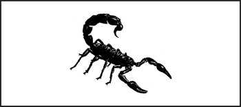
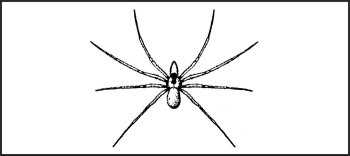
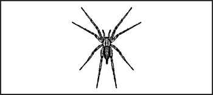
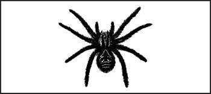
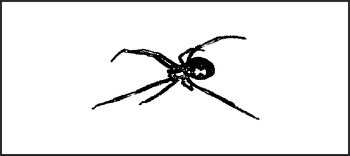
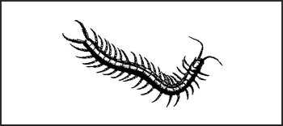
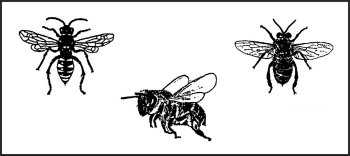
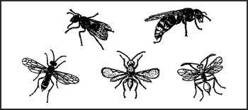
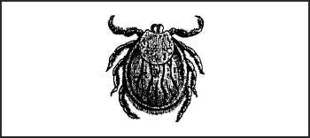

> Insects are often overlooked as a danger to the survivor. More people in the United States die each year from bee stings, and resulting anaphylactic shock, than from snake bites. A few other insects are venomous enough to kill, but often the greatest danger is the transmission of disease.
** *

**Scorpion**  
_Scorpionidae_ order  

**Description:** Dull brown, yellow, or black. Have 7.5- to 20-centimeter long (3- to 8-inch long) lobsterlike pincers and jointed tail usually held over the back. There are 800 species of scorpions.

**Habitat:** Decaying matter, under debris, logs, and rocks. Feeds at night. Sometimes hides in boots.

**Distribution:** Worldwide in temperate, arid, and tropical regions.

> **CAUTION**
>
> Scorpions sting with their tails, causing local pain, swelling, possible incapacitation, and death.
** *

**Brown house spider or brown recluse spider**  
_Laxosceles reclusa_  

**Description:** Brown to black with obvious "fiddle" on back of head and thorax. Chunky body with long, slim legs 2.5 to 4 centimeters (1 to 1 1/2 inches) long.

**Habitat:** Under debris, rocks, and logs. In caves and dark places.

**Distribution:** North America.

** *

**Funnelweb spider**  
_Atrax_ species (_A. robustus, A. formidablis_)  

**Description:** Large, brown, bulky spiders. Aggressive when disturbed.

**Habitat:** Woods, jungles, and brushy areas. Web has a funnel-like opening.

**Distribution:** Australia. (Other nonvenomous species worldwide.)
** *

**Tarantula**  
_Theraphosidae_ and _Lycosa_ species  

**Description:** Very large, brown, black, reddish, hairy spiders. Large fangs inflict painful bite.

**Habitat:** Desert areas, tropics.

**Distribution:** Americas, southern Europe.

** *

**Widow spider**  
_Latrodectus_ species  

**Description:** Dark spiders with light red or orange markings on female's abdomen.

**Habitat:** Under logs, rocks, and debris. In shaded places.

**Distribution:** Varied species worldwide. Black widow in United States, red widow in Middle East, and brown widow in Australia.

**NOTE:** Females are the poisonous gender. Red widow in the Middle East is the only spider known to be deadly to man.
** *

**Centipede**  

**Description:** Multi-joined body to 30 centimeters (12 inches) long. Dull orange to brown, with black point eyes at the base of the antenna. There are 2,800 species worldwide.

**Habitat:** Under bark and stones by day. Active at night.

**Distribution:** Worldwide.
** *

**Bee**  

**Description:** Insect with brown or black, hairy bodies. Generally found in colonies. Many build wax combs.

**Habitat:** Hollow trees, caves, dwellings. Near water in desert areas.

**Distribution:** Worldwide.

**NOTE:** Bees have barbed stingers and die after stinging because their venom sac and internal organs are pulled out during the attack.

** *

**Wasps and hornets**  

**Description:** Generally smooth-bodied, slender stinging insects. Many nest individually in mud nests or in paper nest colonies. Smooth stinger permits multiple attacks. There are several hundred species worldwide.

**Habitat:** May be found anywhere in various species.

**Distribution:** Worldwide.

**NOTE:** An exception to general appearance is the velvet ant of the southern United States. It is a flightless wasp with red and black alternating velvety bands.
** *

**Tick**  

**Description:** Round body from size of pinhead to 2.5 centimeters. Has 8 legs and sucking mouth parts. There are 850 species worldwide.

**Habitat:** Mainly in forests and grasslands. Also in urban areas and farmlands.

**Distribution:** Worldwide.