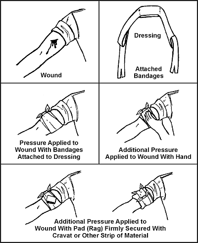
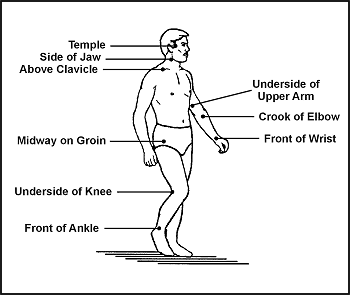
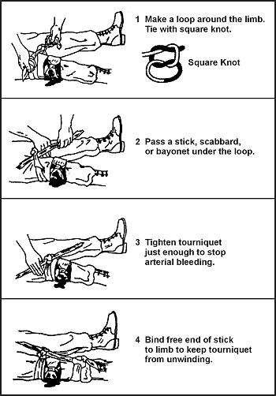
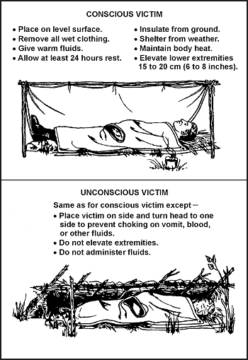
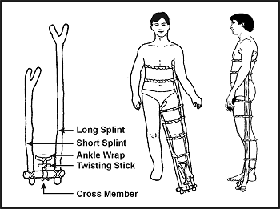
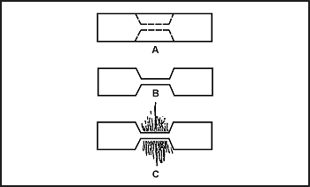

> Foremost among the many problems that can compromise your survival ability are medical problems resulting from unplanned events, such as a accidental injuries or extreme climates.
> 
> Many evaders and survivors have reported difficulty in treating injuries and illness due to lack of training and medical supplies.
> 
> Survivors have related feelings of apathy and helplessness because they could not treat themselves in their environment. The ability to treat yourself increases your morale and aids in your survival and eventual return to friendly forces.
> 
> One man with a fair amount of basic medical knowledge can make a difference in the lives of many. **Without qualified medical personnel available, it is you, who must know what to do to stay alive.**

### REQUIREMENTS FOR MAINTENANCE OF HEALTH

To survive, you need water and food. You must also have and apply high personal hygiene standards.

**WATER**

Your body loses water through normal body processes (sweating, urinating, and defecating). During average daily exertion when the atmospheric temperature is 20 degrees Celsius (C) (68 degrees Fahrenheit [F]), the average adult loses 2 to 3 liters of water. Other factors can cause your body to lose more water, such as heat exposure, cold exposure, intense activity, high altitude, burns, or illness. You must replace this water.

Dehydration results from inadequate replacement of lost body fluids. It decreases your efficiency and, if you are injured, it increases susceptibility to severe shock. Consider the following results of body fluid loss:

* A 5-percent loss results in thirst, irritability, nausea, and weakness.
* A 10-percent loss results in dizziness, headache, inability to walk, and a tingling sensation in the limbs.
* A 15-percent loss results in dim vision, painful urination, swollen tongue, deafness, and a numb feeling in the skin.
* A loss greater than 15 percent may result in death.

The most common signs and symptoms of dehydration are:

* Dark urine with a very strong odor (Generally, the darker the urine, the more dehydrated you are).
* Low urine output.
* Dark, sunken eyes.
* Fatigue.
* Emotional instability.
* Loss of skin elasticity.
* Delayed capillary refill in fingernail beds.
* Trench line down center of tongue.
* Thirst (Last on the list because you are already 2-percent dehydrated by the time you crave fluids).

You should replace water as you lose it. Trying to make up a deficit is difficult in a survival situation, and thirst is not a sign of how much water you need.

Most people cannot comfortably drink more than 1 liter of water at a time. So, even when not thirsty, drink small amounts of water at regular intervals each hour to prevent dehydration.

If you are under physical and mental stress, or subject to severe conditions, increase your water intake. Drink enough liquids to maintain a urine output of at least 0.5 liters every 24 hours. Urine color is one indicator of hydration levels.

In any situation where food intake is low, drink 6 to 8 liters of water per day. In an extreme climate, especially an arid one, the average person can lose 2.5 to 3.5 liters of water **per hour**. In this type of climate, you should drink 8 to 12 ounces of water every 30 minutes. It is better to regulate water loss through work or rest cycles because overhydration can occur if water intake exceeds 1.5 quarts per hour. Overhydration can cause low serum sodium levels resulting in cerebral and pulmonary edema, which can lead to death.

With the loss of water there is also a loss of electrolytes (body salts). The average diet can usually keep up with these losses, but in an extreme situation or illness, additional sources are necessary. You should maintain an intake of carbohydrates and other necessary electrolytes.

You can make an Oral Rehydration Salts (ORS) drink to replace lost salts after severe diarrhea or vomiting by mixing 0.5 teaspoons of salt and 2 tablespoons of sugar in 1 liter of water. Recommended amounts to drink vary by body mass:

* Babies and infants (0-2 years): 0.5 liters every 24 hours
* Children (2-9 years): 1 liter every 24 hours
* Older children and adults: 3 liters every 24 hours

Of all the physical problems encountered in a survival situation, the loss of water is the most preventable. The following are basic guidelines for the prevention of dehydration:

* _Always drink water when eating._ Water is used as a part of the digestion process and can lead to dehydration.
* _Acclimatize._ The body performs more efficiently in extreme conditions when acclimatized.
* _Conserve sweat, not water._ Limit sweat-producing activities but drink water.
* _Ration water._ Until you find a suitable source, ration your sweat, not your water. Limit activity and heat gain or loss.

You can estimate fluid loss by several means. A field dressing holds about 0.25 liters (1/4 canteen) of fluid. A soaked T-shirt holds 0.5 to 0.75 liters.

You can also use the pulse and breathing rate to estimate fluid loss. Use the following as a guide:

* With a 0.75-liter loss the wrist pulse rate will be under 100 beats per minute and the breathing rate 12 to 20 breaths per minute.
* With a 0.75 to 1.5-liter loss the pulse rate will be 100 to 120 beats per minute and 20 to 30 breaths per minute.
* With a 1.5 to 2-liter loss the pulse rate will be 120 to 140 beats per minute and 30 to 40 breaths per minute. Vital signs above these rates require advanced care.

Make sure the water you drink does not contain harmful contaminants. Ideally carry [a LifeStraw](LifeStraw) as part of [your kit](Kits) to filter the water. Read more about it in the [water chapter](Water)

**FOOD**

Although you can live several weeks without food, you need an adequate amount to stay healthy. Without food your mental and physical capabilities will deteriorate rapidly and you will become weak. Food provides energy and replenishes the substances that your body burns. Food provides vitamins, minerals, salts, and other elements essential to good health. And, possibly more important, it helps morale.

The three basic sources of food are plants, animals (including fish) and fungus. In varying degrees, these provide the calories, carbohydrates, fats, and proteins needed for normal daily body functions. You should use rations to augment plant and animal foods, which will extend and help maintain a balanced diet.

Calories are a measure of heat and potential energy. The average person needs 2,000 calories per day to function at a minimum level. An adequate amount of carbohydrates, fats, and proteins without an adequate caloric intake will lead to starvation and cannibalism of the body's own tissue for energy. It may be useful to estimate your TDEE (Total Daily Energy Expenditure) since each individual requires different caloric minimums.

**Plants**

Plant foods provide carbohydrates—the main source of energy. Many plants provide enough protein to keep the body at normal efficiency. Although plants may not provide a balanced diet, they will sustain you even in the arctic, where meat's heat-producing qualities are normally essential. Many plant foods such as nuts and seeds will give you enough protein and oils for normal efficiency. Roots, green vegetables, and plant foods containing natural sugar will provide calories and carbohydrates that give the body natural energy.

The food value of plants becomes more and more important if you are eluding enemies or if you are in an area where wildlife is scarce. For instance:

* You can dry plants by wind, air, sun, or fire. This retards spoilage so that you can store or carry the plant food with you to use when needed.
* You can often obtain plants more easily than meat.

**Animals**

Meat is more nourishing than plant food. It may even be more readily available in some places. However, to get meat, you need to know the habits of (and how to capture) the various wildlife.

To satisfy immediate food needs, first seek the more abundant and easily obtained wildlife. This includes insects, crustaceans, mollusks, fish, and reptiles. These can satisfy hunger while you are preparing traps and snares for larger game.

**PERSONAL HYGIENE**

Cleanliness is always an important factor in preventing infection and disease. This becomes even more important in a survival situation since poor hygiene can reduce chances of survival.

A daily shower with hot water and soap is ideal, but you can stay clean without this luxury. Use a cloth and soapy water to wash yourself. Pay special attention to the feet, armpits, crotch, hands, and hair as these are prime areas for infestation and infection. If water is scarce, take an "air" bath. Remove as much of your clothing as practical and expose your body to the sun and air for at least 1 hour. Be careful not to sunburn.

If you don't have soap, use ashes or sand, or make soap from animal fat and wood ashes if your situation allows. To make soap:

* Extract grease from animal fat by cutting the fat into small pieces and cooking it in a pot.
* Add enough water to the pot to keep the fat from sticking as it cooks.
* Cook the fat slowly, stirring frequently.
* After the fat is rendered, pour the grease into a container to harden.
* Place ashes in a container with a spout near the bottom.
* Pour water over the ashes and collect the liquid that drips out of the spout in a separate container. This liquid is the potash or lye.

Another way to get the lye is to pour the slurry (the mixture of ashes and water) through a straining cloth.

* In a cooking pot, mix two parts grease to one part lye.
* Place this mixture over a fire and boil it until it thickens.

After the mixture (the soap) cools, you can use it in the semiliquid state directly from the pot. You can also pour it into a pan, allow it to harden, and cut it into bars for later use.

**Keep Your Hands Clean**

Germs on your hands can infect food and wounds. Wash your hands after handling any material that is likely to carry germs, after urinating or defecating, after caring for the sick, and before handling any food, food utensils, or drinking water. Keep your fingernails closely trimmed and clean, and keep your fingers out of your mouth.

**Keep Your Hair Clean**

Hair can become a haven for bacteria, fleas, lice, and other parasites. Keeping your hair clean, combed, and trimmed helps you avoid this danger.

**Keep Your Clothing Clean**

Keep your clothing and bedding as clean as possible to reduce the chances of skin infection or parasitic infestation. Clean your outer clothing whenever it becomes soiled. Wear clean underclothing and socks each day. If water is scarce, "air" clean your clothing by shaking, airing, and sunning it for 2 hours. If you are using a sleeping bag, turn it inside out after each use, fluff it, and air it.

**Keep Your Teeth Clean**

Thoroughly clean your mouth and teeth with a toothbrush at least once each day. If you don't have a toothbrush, make a chewing stick. Find a twig about 20 centimeters (cm) (8 inches) long and 1 centimeter (1/3 inch) wide. Chew one end of the stick to separate the fibers. Then brush your teeth thoroughly. Another way is to wrap a clean strip of cloth around your fingers and rub your teeth with it to wipe away food particles. You can also brush your teeth with small amounts of sand, baking soda, salt, or soap. Rinse your mouth with water, salt water, or willow bark tea. Flossing your teeth with string or fiber also helps oral hygiene.

If you have cavities, you can make temporary fillings by placing candle wax, tobacco, hot pepper, toothpaste or powder, or portions of a gingerroot into the cavity. Make sure you clean the cavity by rinsing or picking the particles out of the cavity before placing a filling in the cavity.

**Take Care of Your Feet**

To prevent serious foot problems, break in your shoes before wearing them on any mission. Wash and massage your feet daily. Trim your toenails straight across. Wear an insole and the proper size of dry socks. Powder and check your feet daily for blisters.

If you get a small blister, do not open it. An intact blister is safe from infection. Apply a padding material around the blister to relieve pressure and reduce friction. If the blister bursts, treat it as an open wound. Clean and dress it daily and pad around it. Leave large blisters intact. To avoid having the blister burst or tear under pressure and cause a painful and open sore, do the following:

* Obtain a sewing-type needle and a clean or sterilized thread.
* Run the needle and thread through the blister after cleaning the blister.
* Detach the needle and leave both ends of the thread hanging out of the blister. The thread will absorb the liquid inside. This reduces the size of the hole and ensures that the hole does not close up.
* Pad around the blister.

**Get Sufficient Rest**

You need a certain amount of rest to keep going. Plan for regular rest periods of at least 10 minutes per hour during your daily activities. Learn to make yourself comfortable under less-than-ideal conditions. A change from mental to physical activity or vice versa can be refreshing when time or situation does not permit total relaxation.

**Keep Campsite Clean**

Do not soil the ground in the campsite area with urine or feces. Use latrines, if available. When latrines are not available, dig "cat holes" and cover the waste. Collect drinking water upstream from the campsite. Purify all water.

### MEDICAL EMERGENCIES

Medical problems and emergencies you may face include breathing problems, severe bleeding, and shock. The following paragraphs explain each of these problems and what you can expect if they occur.

**BREATHING PROBLEMS**

Any one of the following can cause airway obstruction, resulting in stopped breathing:

* Foreign matter in mouth or throat which obstructs the opening to the trachea.
* Face or neck injuries.
* Inflammation and swelling of mouth and throat caused by inhaling smoke, flames, irritating vapors, or by an allergic reaction.
* "Kink" in the throat (caused by the neck bent forward so that the chin rests upon the chest).
* Tongue blocks passage of air to the lungs upon unconsciousness. When an individual is unconscious, the muscles of the lower jaw and tongue relax as the neck drops forward. This causes the lower jaw to sag and the tongue to drop back and block the passage of air.

**SEVERE BLEEDING**

Severe bleeding from any major blood vessel in the body is extremely dangerous. The loss of 1 liter of blood will produce moderate symptoms of shock. The loss of 2 liters will produce a severe state of shock that places the body in extreme danger. The loss of 3 liters is usually fatal.

**SHOCK**

Shock (acute stress reaction) is not a disease in itself. It is a clinical condition characterized by symptoms that arise when cardiac output is insufficient to fill the arteries with blood under enough pressure to provide an adequate blood supply to the organs and tissues.

### LIFESAVING STEPS

Control panic, both your own and the victim's. Reassure him and try to keep him quiet. Perform a rapid physical exam. Look for the cause of the injury and follow the ABCs of first aid. Start with the airway and breathing, but be discerning. In some cases, a person may die from arterial bleeding more quickly than from an airway obstruction. The following paragraphs describe how to treat airway, bleeding, and shock emergencies.

**OPEN AIRWAY AND MAINTAIN**

You can open an airway and maintain it by using the following steps:

* _Step 1._ You should check to see if the victim has a partial or complete airway obstruction. If he can cough or speak, allow him to clear the obstruction naturally. Stand by, reassure the victim, and be ready to clear his airway and perform mouth-to-mouth resuscitation should he become unconscious. If his airway is completely obstructed, administer abdominal thrusts until the obstruction is cleared.
* _Step 2._ Using a finger, quickly sweep the victim's mouth clear of any foreign objects, broken teeth, dentures, and sand.
* _Step 3._ Using the jaw thrust method, grasp the angles of the victim's lower jaw and lift with both hands, one on each side, moving the jaw forward. For stability, rest your elbows on the surface on which the victim is lying. If his lips are closed, gently open the lower lip with your thumb. 

 <!-- https://raw.githubusercontent.com/inferno986return/SurvivalManual-ebook/main/e-book/OEBPS/images/basic_medicine/fig04-01.png -->

**Figure 4-1\. Jaw Thrust Method**

* _Step 4._ With the victim's airway open, pinch his nose closed with your thumb and forefinger and blow two complete breaths into his lungs. Allow the lungs to deflate after the second inflation and perform the following:
 *  **Look** for his chest to rise and fall.
 *  **Listen** for escaping air during exhalation.
 *  **Feel** for flow of air on your cheek.
* _Step 5._ If the forced breaths do not stimulate spontaneous breathing, maintain the victim's breathing by performing mouth-to-mouth resuscitation.
* _Step 6._ There is danger of the victim vomiting during mouth-to-mouth resuscitation. Check the victim's mouth periodically for vomit and clear as needed.

**NOTE:** Cardiopulmonary resuscitation (CPR) may be necessary after cleaning the airway, but only after major bleeding is under control. See FM 21-20, _Physical Fitness Training_, the American Heart Association manual, the Red Cross manual, or most other first aid books for detailed instructions on CPR.

**CONTROL BLEEDING**

In a survival situation, you must control serious bleeding immediately because replacement fluids normally are not available and the victim can die within a matter of minutes. External bleeding falls into the following classifications (according to its source):

* _Arterial._ Blood vessels called arteries carry blood away from the heart and through the body. A cut artery issues _bright red_ blood from the wound in _distinct spurts_ _or pulses_ that correspond to the rhythm of the heartbeat. Because the blood in the arteries is under high pressure, an individual can lose a large volume of blood in a short period when damage to an artery of significant size occurs. Therefore, arterial bleeding is the most serious type of bleeding. If not controlled promptly, it can be fatal.
* _Venous_. Venous blood is blood that is returning to the heart through blood vessels called veins. A steady flow of _dark red, maroon, or bluish_ _blood_ characterizes bleeding from a vein. You can usually control venous bleeding more easily than arterial bleeding.
* _Capillary._ The capillaries are the extremely small vessels that connect the arteries with the veins. Capillary bleeding most commonly occurs in minor cuts and scrapes. This type of bleeding is not difficult to control.

You can control external bleeding by direct pressure, indirect (pressure points) pressure, elevation, digital ligation, or tourniquet. Each method is explained below.

**Direct Pressure**

The most effective way to control external bleeding is by applying pressure directly over the wound. This pressure must not only be firm enough to stop the bleeding, but it must also be maintained long enough to "seal off" the damaged surface.

If bleeding continues after having applied direct pressure for 30 minutes, apply a pressure dressing. This dressing consists of a thick dressing of gauze or other suitable material applied directly over the wound and held in place with a tightly wrapped bandage ([Figure 4-2](#fig4-2)). It should be tighter than an ordinary compression bandage but not so tight that it impairs circulation to the rest of the limb. Once you apply the dressing, **do not remove it**, even when the dressing becomes blood soaked.

**Figure 4-2\. Application of a Pressure Dressing**

Leave the pressure dressing in place for 1 or 2 days, after which you can remove and replace it with a smaller dressing. In the long-term survival environment, make fresh, daily dressing changes and inspect for signs of infection.

**Elevation**

Raising an injured extremity as high as possible above the heart's level slows blood loss by aiding the return of blood to the heart and lowering the blood pressure at the wound. However, elevation alone will not control bleeding entirely; you must also apply direct pressure over the wound. When treating a snakebite, be sure to keep the extremity **lower** than the heart.

**Pressure Points**

A pressure point is a location where the main artery to the wound lies near the surface of the skin or where the artery passes directly over a bony prominence ([Figure 4-3](#fig4-3)). You can use digital pressure on a pressure point to slow arterial bleeding until the application of a pressure dressing. Pressure point control is not as effective for controlling bleeding as direct pressure exerted on the wound. It is rare when a single major compressible artery supplies a damaged vessel.

**Figure 4-3\. Pressure Points**

If you cannot remember the exact location of the pressure points, follow this rule: Apply pressure at the end of the joint just above the injured area. On hands, feet, and head, this will be the wrist, ankle, and neck, respectively.

> **WARNING**
>
> Use caution when applying pressure to the neck. Too much pressure for too long may cause unconsciousness or death. Never place a tourniquet around the neck.

Maintain pressure points by placing a round stick in the joint, bending the joint over the stick, and then keeping it tightly bent by lashing. By using this method to maintain pressure, it frees your hands to work in other areas.

**Digital Ligation**

You can stop major bleeding immediately or slow it down by applying pressure with a finger or two on the bleeding end of the vein or artery. Maintain the pressure until the bleeding stops or slows down enough to apply a pressure bandage, elevation, and so forth.

**Tourniquet**

Use a tourniquet only when direct pressure over the bleeding point and all other methods did not control the bleeding. If you leave a tourniquet in place too long, the damage to the tissues can progress to gangrene, with a loss of the limb later. An improperly applied tourniquet can also cause permanent damage to nerves and other tissues at the site of the constriction. If you must use a tourniquet, place it around the extremity, between the wound and the heart, 5 to 10 centimeters (2 to 4 inches) above the wound site. Never place it directly over the wound or a fracture. [Figure 4-4](#fig4-4) explains how to apply a tourniquet.

**Figure 4-4\. Application of Tourniquet**

After you secure the tourniquet, clean and bandage the wound. A lone survivor **does not** remove or release an applied tourniquet. However, in a buddy system, the buddy can release the tourniquet pressure every 10 to 15 minutes for 1 or 2 minutes to let blood flow to the rest of the extremity to prevent limb loss.

**PREVENT AND TREAT SHOCK**

Anticipate shock in all injured personnel. Treat all injured persons as follows, regardless of what symptoms appear ([Figure 4-5](#fig4-5)):

* If the victim is conscious, place him on a level surface with the lower extremities elevated 15 to 20 centimeters (6 to 8 inches).
* If the victim is unconscious, place him on his side or abdomen with his head turned to one side to prevent choking on vomit, blood, or other fluids.
* If you are unsure of the best position, place the victim perfectly flat. Once the victim is in a shock position, do not move him.
* Maintain body heat by insulating the victim from the surroundings and, in some instances, applying external heat.
* If wet, remove all the victim's wet clothing as soon as possible and replace with dry clothing.
* Improvise a shelter to insulate the victim from the weather.
* External warmth can be provided with warm liquids or foods, a prewarmed sleeping bag, another person, warmed water in canteens, hot rocks wrapped in clothing, or fires on either side of the victim.
* If the victim is conscious, slowly administer small doses of a warm salt or sugar solution, if available.
* If the victim is unconscious or has abdominal wounds, do not give fluids by mouth.
* Have the victim rest for at least 24 hours.
* If you are a lone survivor, lie in a depression in the ground, behind a tree, or any other place out of the weather, with your head lower than your feet.
* If you are with a buddy, reassess your patient constantly.

**Figure 4-5\. Treatment for Shock**

### BONE AND JOINT INJURY

You could face bone and joint injuries that include fractures, dislocations, and sprains. Follow the steps explained below for each injury.

**FRACTURES**

There are basically two types of fractures: open and closed. With an open (or compound) fracture, the bone protrudes through the skin and complicates the actual fracture with an open wound. Any bone protruding from the wound should be cleaned with an antiseptic and kept moist. You should splint the injured area and continually monitor blood flow past the injury. Only reposition the break if there is no blood flow.

The closed fracture has no open wounds. Follow the guidelines for immobilization and splint the fracture.

The signs and symptoms of a fracture are pain, tenderness, discoloration, swelling deformity, loss of function, and grating (a sound or feeling that occurs when broken bone ends rub together).

The dangers with a fracture are the severing or the compression of a nerve or blood vessel at the site of fracture. For this reason minimum manipulation should be done, and only very cautiously. If you notice the area below the break becoming numb, swollen, cool to the touch, or turning pale, and the victim showing signs of shock, a major vessel may have been severed. You must control this internal bleeding. Reset the fracture, treat the victim for shock, and replace lost fluids.

Often you must maintain traction during the splinting and healing process. You can effectively pull smaller bones such as the arm or lower leg by hand. You can create traction by wedging a hand or foot in the V-notch of a tree and pushing against the tree with the other extremity. You can then splint the break.

Strong muscles hold a broken thighbone (femur) in place making it difficult to maintain traction during healing. You can make an improvised traction splint using natural material ([Figure 4-6](#fig4-6)) as explained below.

**Figure 4-6\. Improvised Traction Splint**

* Get two forked branches or saplings at least 5 centimeters (2 inches) in diameter. Measure one from the patient's armpit to 20 to 30 centimeters (8 to 12 inches) past his unbroken leg. Measure the other from the groin to 20 to 30 centimeters (8 to 12 inches) past the unbroken leg. Ensure that both extend an equal distance beyond the end of the leg.
* Pad the two splints. Notch the ends without forks and lash a 20- to 30-centimeter (8- to 12-inch) cross member made from a 5-centimeter (2-inch) diameter branch between them.
* Using available material (vines, cloth, rawhide), tie the splint around the upper portion of the body and down the length of the broken leg. Follow the splinting guidelines.
* With available material, fashion a wrap that will extend around the ankle, with the two free ends tied to the cross member.
* Place a 10- by 2.5-centimeter (4- by 1-inch) stick in the middle of the free ends of the ankle wrap between the cross member and the foot. Using the stick, twist the material to make the traction easier.
* Continue twisting until the broken leg is as long or slightly longer than the unbroken leg.
* Lash the stick to maintain traction.

**NOTE:** Over time, you may lose traction because the material weakened. Check the traction periodically. If you must change or repair the splint, maintain the traction manually for a short time.

**DISLOCATIONS**

Dislocations are the separations of bone joints causing the bones to go out of proper alignment. These misalignments can be extremely painful and can cause an impairment of nerve or circulatory function below the area affected. You must place these joints back into alignment as quickly as possible.

Signs and symptoms of dislocations are joint pain, tenderness, swelling, discoloration, limited range of motion, and deformity of the joint. You treat dislocations by reduction, immobilization, and rehabilitation.

Reduction or "setting" is placing the bones back into their proper alignment. You can use several methods, but manual traction or the use of weights to pull the bones are the safest and easiest. Once performed, reduction decreases the victim's pain and allows for normal function and circulation. Without an X ray, you can judge proper alignment by the look and feel of the joint and by comparing it to the joint on the opposite side.

Immobilization is nothing more than splinting the dislocation after reduction. You can use any field-expedient material for a splint or you can splint an extremity to the body. The basic guidelines for splinting are as follows:

* Splint above and below the fracture site.
* Pad splints to reduce discomfort.
* Check circulation below the fracture after making each tie on the splint.

To rehabilitate the dislocation, remove the splints after 7 to 14 days. Gradually use the injured joint until fully healed.

**SPRAINS**

The accidental overstretching of a tendon or ligament causes sprains. The signs and symptoms are pain, swelling, tenderness, and discoloration (black and blue).

When treating sprains, you should follow the letters in **RICE** as defined below:

* **R**est injured area.
* **I**ce for 24 to 48 hours.
* **C**ompression-wrap or splint to help stabilize. If possible, leave the boot on a sprained ankle unless circulation is compromised.
* **E**levate the affected area.

**NOTE:** Ice is preferred for a sprain but cold spring water may be more easily obtained in a survival situation.

### BITES AND STINGS

Insects and related pests are hazards in a survival situation. They not only cause irritations, but they are often carriers of diseases that cause severe allergic reactions in some individuals. In many parts of the world you will be exposed to serious, even fatal, diseases not encountered in the United States.

* Ticks can carry and transmit diseases, such as Rocky Mountain spotted fever common in many parts of the United States. Ticks also transmit Lyme disease.
* Mosquitoes may carry malaria, dengue, and many other diseases.
* Flies can spread disease from contact with infectious sources. They are causes of sleeping sickness, typhoid, cholera, and dysentery.
* Fleas can transmit plague.
* Lice can transmit typhus and relapsing fever.

The best way to avoid the complications of insect bites and stings is to keep immunizations (including booster shots) up-to-date, avoid insect-infested areas, use netting and insect repellent, and wear all clothing properly.

If you are bitten or stung, do not scratch the bite or sting, it might become infected. Inspect your body at least once a day to ensure there are no insects attached to you. If you find ticks attached to your body, cover them with a substance (such as petroleum jelly, heavy oil, or tree sap) that will cut off their air supply. Without air, the tick releases it's hold, and you can remove it. Take care to remove the whole tick. Use tweezers if you have them. Grasp the tick where it's mouthparts are attached to the skin. Do not squeeze the tick's body. Wash your hands after touching the tick. Clean the tick wound daily until healed.

**TREATMENT**

It is impossible to list the treatment of all the different types of bites and stings. However, you can generally treat bites and stings as follows:

* If antibiotics are available for your use, become familiar with them before deployment and use them.
* Predeployment immunizations can prevent most of the common diseases carried by mosquitoes and some carried by flies.
* The common fly-borne diseases are usually treatable with penicillins or erythromycin.
* Most tick, flea, louse, and mite-borne diseases are treatable with tetracycline.
* Most antibiotics come in 250 milligram (mg) or 500 mg tablets. If you cannot remember the exact dose rate to treat a disease, 2 tablets, 4 times a day, for 10 to 14 days will usually kill any bacteria. (80 to 112 tablets total.)

**BEE AND WASP STINGS**

If stung by a bee, immediately remove the stinger and venom sac, if attached, by scraping with a fingernail or a knife blade. Do not squeeze or grasp the stinger or venom sac, as squeezing will force more venom into the wound. Wash the sting site thoroughly with soap and water to lessen the chance of a secondary infection.

If you know or suspect that you are allergic to insect stings, always carry an insect sting kit with you.

Relieve the itching and discomfort caused by insect bites by applying:

* Cold compresses.
* A cooling paste of mud and ashes.
* Sap from dandelions.
* Coconut meat.
* Crushed cloves of garlic.
* Onion.

**SPIDER BITES AND SCORPION STINGS**

The black widow spider is identified by a red hourglass on it's abdomen. Only the female bites, and it has a neurotoxic venom. The initial pain is not severe, but severe local pain rapidly develops. The pain gradually spreads over the entire body and settles in the abdomen and legs. Abdominal cramps and progressive nausea, vomiting, and a rash may occur. Weakness, tremors, sweating, and salivation may occur. Anaphylactic reactions can occur. Symptoms may worsen for the next three days and then begin to subside for the next week. Treat for shock. Be ready to perform CPR. Clean and dress the bite area to reduce the risk of infection. An antivenom is available.

The funnel web spider is a large brown or gray spider found in Australia. The symptoms and the treatment for its bite are identical to the black widow spider.

The brown house spider or brown recluse spider is a small, light brown spider identified by a dark brown violin on its back. There is no pain, or so little pain, that usually a victim is not aware of the bite. Within a few hours a painful red area with a mottled cyanotic center appears. Necrosis does not occur in all bites, but usually in 3 to 4 days, a star-shaped, firm area of deep purple discoloration appears at the bite site. The area turns dark and mummified in a week or two. The margins separate and the scab falls off, leaving an open ulcer. Secondary infection and regional swollen lymph glands usually become visible at this stage. The outstanding characteristic of the brown recluse bite is an ulcer that does not heal but persists for weeks or months. In addition to the ulcer, there is often a systemic reaction that is serious and may lead to death. Reactions (fever, chills, joint pain, vomiting, and a generalized rash) occur chiefly in children or debilitated persons.

Tarantulas are large, hairy spiders found mainly in the tropics. Most do not inject venom, but some South American species do. They have large fangs. If bitten, pain and bleeding are certain, and infection is likely. Treat a tarantula bite as for any open wound, and try to prevent infection. If symptoms of poisoning appear, treat as for the bite of the black widow spider.

Scorpions are all poisonous. There are two different reactions, depending on the species:
* Severe local reaction only, with pain and swelling around the area of the sting. Possible prickly sensation around the mouth and a thick-feeling tongue.
* Severe systemic reaction, with little or no visible local reaction. Local pain may be present. Systemic reaction includes respiratory difficulties, thick-feeling tongue, body spasms, drooling, gastric distention, double vision, blindness, involuntary rapid movement of the eyeballs, involuntary urination and defecation, and heart failure. Death is rare, occurring mainly in children and adults with high blood pressure or illnesses.

Treat scorpion stings as you would a black widow bite.

**SNAKEBITES**

The chance of a snakebite in a survival situation is rather small, if you are familiar with the various types of snakes and their habitats. However, it could happen and you should know how to treat a snakebite. Deaths from snakebites are rare. More than half of snakebite victims have little or no poisoning, and only about one-quarter develop serious systemic poisoning. However, the chance of a snakebite in a survival situation can affect morale, and failure to take preventive measures or failure to treat a snakebite properly can result in needless tragedy.

The primary concern in the treatment of snakebite is to limit the amount of eventual tissue destruction around the bite area.

A bite wound, regardless of the type of animal that inflicted it, can become infected from bacteria in the animal's mouth. With nonpoisonous as well as poisonous snakebites, this local infection is responsible for a large part of the residual damage that results.

Snake venoms not only contain poisons that attack the victim's central nervous system (neurotoxins) and blood circulation (hemotoxins), but also digestive enzymes (cytotoxins) to aid in digesting their prey. These poisons can cause a very large area of tissue death, leaving a large open wound. This condition could lead to the need for eventual amputation if not treated.

Shock and panic in a person bitten by a snake can also affect the person's recovery. Excitement, hysteria, and panic can speed up the circulation, causing the body to absorb the toxin quickly. Signs of shock occur within the first 30 minutes after the bite.

Before you start treating a snakebite, determine whether the snake was poisonous or nonpoisonous. Bites from a nonpoisonous snake will show rows of teeth. Bites from a poisonous snake may have rows of teeth showing, but will have one or more distinctive puncture marks caused by fang penetration. Symptoms of a poisonous bite may be spontaneous bleeding from the nose and anus, blood in the urine, pain at the site of the bite, and swelling at the site of the bite within a few minutes or up to 2 hours later.

Breathing difficulty, paralysis, weakness, twitching, and numbness are also signs of neurotoxic venoms. These signs usually appear 1.5 to 2 hours after the bite.

If you determine that a poisonous snake bit an individual, take the following steps:

* Reassure the victim and keep him still.
* Set up for shock and force fluids or give by intravenous (IV) means.
* Remove watches, rings, bracelets, or other constricting items.
* Clean the bite area.
* Maintain an airway (especially if bitten near the face or neck) and be prepared to administer mouth-to-mouth resuscitation or CPR.
* Use a constricting band between the wound and the heart.
* Immobilize the site.
* Remove the poison as soon as possible by using a mechanical suction device. Do not squeeze the site of the bite.

You should also remember four very important guidelines during the treatment of snakebites. **Do not**:

* Give the victim alcoholic beverages or tobacco products. Never give atropine! - Give morphine or other central nervous system (CNS) depressors.
* Make any deep cuts at the bite site. Cutting opens capillaries that in turn open a direct route into the blood stream for venom and infection.

**NOTE:** If medical treatment is over 1 hour away, make an incision (no longer than 6 millimeters [1/4 inch] and no deeper than 3 millimeters [1/8 inch]) over each puncture, cutting just deep enough to enlarge the fang opening, but only through the first or second layer of skin. Place a suction cup over the bite so that you have a good vacuum seal. Suction the bite site 3 to 4 times. Suction for a **MINIMUM of 30 MINUTES**. Use mouth suction **only** as a last resort and **only** if you do not have open sores in your mouth. Spit the envenomed blood out and rinse your mouth with water. This method will draw out 25 to 30 percent of the venom.

* Don't put your hands on your face or rub your eyes, as venom may be on your hands. Venom may cause blindness.
* Break open the large blisters that form around the bite site.

After caring for the victim as described above, take the following actions to minimize local effects:

* If infection appears, keep the wound open and clean.
* Use heat after 24 to 48 hours to help prevent the spread of local infection. Heat also helps to draw out an infection.
* Keep the wound covered with a dry, sterile dressing.
* Have the victim drink large amounts of fluids until the infection is gone.

### WOUNDS

An interruption of the skin's integrity characterizes wounds. These wounds could be open wounds, skin diseases, frostbite, trench foot, or burns.

**OPEN WOUNDS**

Open wounds are serious in a survival situation, not only because of tissue damage and blood loss, but also because they may become infected. Bacteria on the object that made the wound, on the individual's skin and clothing, or on other foreign material or dirt that touches the wound may cause infection.

By taking proper care of the wound you can reduce further contamination and promote healing. Clean the wound as soon as possible after it occurs by—

* Removing or cutting clothing away from the wound.
* Always looking for an exit wound if a sharp object, gunshot, or projectile caused a wound.
* Thoroughly cleaning the skin around the wound.
* Rinsing (not scrubbing) the wound with large amounts of water under pressure. You can use fresh urine if water is not available.

The "open treatment" method is the safest way to manage wounds in survival situations. Do not try to close any wound by suturing or similar procedures. Leave the wound open to allow the drainage of any pus resulting from infection. As long as the wound can drain, it generally will not become life-threatening, regardless of how unpleasant it looks or smells.

Cover the wound with a clean dressing. Place a bandage on the dressing to hold it in place. Change the dressing daily to check for infection.

If a wound is gaping, you can bring the edges together with adhesive tape cut in the form of a "butterfly" or "dumbbell" ([Figure 4-7](#fig4-7)). Use this method with extreme caution in the absence of antibiotics. You must always allow for proper drainage of the wound to avoid infection.

**Figure 4-7\. Butterfly Closure**

In a survival situation, some degree of wound infection is almost inevitable. Pain, swelling, and redness around the wound, increased temperature, and pus in the wound or on the dressing indicate infection is present.

If the wound becomes infected, you should treat as follows:

* Place a warm, moist compress directly on the infected wound. Change the compress when it cools, keeping a warm compress on the wound for a total of 30 minutes. Apply the compresses three or four times daily.
* Drain the wound. Open and gently probe the infected wound with a sterile instrument.
* Dress and bandage the wound.
* Drink a lot of water.
* In the event of gunshot or other serious wounds, it may be better to rinse the wound out vigorously every day with the cleanest water available. If drinking water or methods to purify drinking water are limited, do not use your drinking water. Flush the wound forcefully daily until the wound is healed over. Your scar may be larger but your chances of infection are greatly reduced.
* Continue this treatment daily until all signs of infection have disappeared.

If you do not have antibiotics and the wound has become severely infected, does not heal, and ordinary debridement is impossible, consider maggot therapy as stated below, despite its hazards:

* Expose the wound to flies for one day and then cover it.
* Check daily for maggots.
* Once maggots develop, keep wound covered but check daily.
* Remove all maggots when they have cleaned out all dead tissue and before they start on healthy tissue. Increased pain and bright red blood in the wound indicate that the maggots have reached healthy tissue.
* Flush the wound repeatedly with sterile water or fresh urine to remove the maggots.
* Check the wound every 4 hours for several days to ensure all maggots have been removed.
* Bandage the wound and treat it as any other wound. It should heal normally.

**SKIN DISEASES AND AILMENTS**

Boils, fungal infections, and rashes rarely develop into a serious health problem. They cause discomfort and you should treat them as follows:

**Boils**

Apply warm compresses to bring the boil to a head. Another method that can be used to bring a boil to a head is the bottle suction method. Use an empty bottle that has been boiled in water. Place the opening of the bottle over the boil and seal the skin forming an airtight environment that will create a vacuum. This method will draw the pus to the skin surface when applied correctly. Then open the boil using a sterile knife, wire, needle, or similar item. Thoroughly clean out the pus using soap and water. Cover the boil site, checking it periodically to ensure no further infection develops.

**Fungal Infections**

Keep the skin clean and dry, and expose the infected area to as much sunlight as possible. **Do not scratch** the affected area. During the Southeast Asian conflict, soldiers used antifungal powders, lye soap, chlorine bleach, alcohol, vinegar, concentrated salt water, and iodine to treat fungal infections with varying degrees of success. As with any **"unorthodox"** method of treatment, use these with **caution**.

**Rashes**

To treat a skin rash effectively, first determine what is causing it. This determination may be difficult even in the best of situations. Observe the following rules to treat rashes:

* If it is moist, keep it dry.
* If it is dry, keep it moist.
* Do not scratch it.

Use a compress of vinegar or tannic acid derived from tea or from boiling acorns or the bark of a hardwood tree to dry weeping rashes. Keep dry rashes moist by rubbing a small amount of rendered animal fat or grease on the affected area.

Remember, treat rashes as open wounds; clean and dress them daily. There are many substances available to survivors in the wild or in captivity for use as antiseptics to treat wounds. Follow the recommended guidance below:

* _Iodine tablets._ Use 5 to 15 tablets in a liter of water to produce a good rinse for wounds during healing.
* _Garlic._ Rub it on a wound or boil it to extract the oils and use the water to rinse the affected area.
* _Salt water._ Use 2 to 3 tablespoons per liter of water to kill bacteria.
* _Bee honey._ Use it straight or dissolved in water.
* _Sphagnum moss._ Found in boggy areas worldwide, it is a natural source of iodine. Use as a dressing.
* _Sugar._ Place directly on wound and remove thoroughly when it turns into a glazed and runny substance. Then reapply.
* _Syrup._ In extreme circumstances, some of the same benefits of honey and sugar can be realized with any high-sugar-content item.

**NOTE:** Again, use noncommercially prepared materials with caution.

**BURNS**

The following field treatment for burns relieves the pain somewhat, seems to help speed healing, and offers some protection against infection:

* First, stop the burning process. Put out the fire by removing clothing, dousing with water or sand, or by rolling on the ground. Cool the burning skin with ice or water. For burns caused by white phosphorous, pick out the white phosphorous with tweezers. Do not douse with water.
* Soak dressings or clean rags for 10 minutes in a boiling tannic acid solution (obtained from tea, inner bark of hardwood trees, or acorns boiled in water).
* Cool the dressings or clean rags and apply over burns. Sugar and honey also work for burns with honey being especially effective at promoting new skin growth and stopping infections. Use both as you would in an open wound above.
* Treat as an open wound.
* Replace fluid loss. Fluid replacement can be achieved through oral (preferred) and intravenous routes (when resources are available). One alternate method through which rehydration can be achieved is through the rectal route. Fluids do not need to be sterile, only purified. A person can effectively absorb approximately 1 to 1.5 liters per hour by using a tube to deliver fluids into the rectal vault.
* Maintain open airway.
* Treat for shock.
* Consider using morphine, unless the burns are near the face.

### ENVIRONMENTAL INJURIES

Heatstroke, hypothermia, diarrhea, and intestinal parasites are environmental concerns you could face in a survival situation.

**HEATSTROKE**

The breakdown of the body's heat regulatory system (body temperature more than 40.5 degrees C [105 degrees F]) causes a heatstroke. Other heat injuries, such as cramps or dehydration, do not always precede a heatstroke. Signs and symptoms of heatstroke are:

* Swollen, beet-red face.
* Reddened whites of eyes.
* Victim not sweating.
* Unconsciousness or delirium, which can cause pallor, a bluish color to lips and nail beds (cyanosis), and cool skin.

**NOTE:** By this time, the victim is in severe shock. Cool the victim as rapidly as possible. Cool him by dipping him in a cool stream. If one is not available, douse the victim with urine, water, or at the very least, apply cool wet compresses to all the joints, especially the neck, armpits, and crotch. Be sure to wet the victim's head. Heat loss through the scalp is great. Administer IVs and provide drinking fluids. You may fan the individual.

You can expect the following symptoms during cooling:

* Vomiting.
* Diarrhea.
* Struggling.
* Shivering.
* Shouting.
* Prolonged unconsciousness.
* Rebound heatstroke within 48 hours.
* Cardiac arrest; be ready to perform CPR.

**NOTE:** Treat for dehydration with lightly salted water.

**CHILBLAINS**

Frostnip begins as firm, cold, white or gray areas on the face, ears, and extremities. They can blister or peel just like sunburn as late as 2 to 3 days after the injury. Frostnip, or chilblains as it is sometimes called, is the result of tissue exposure to freezing temperatures and is the beginning of frostbite. The water in and around the cells freezes, rupturing cell walls and thus damaging the tissue. Warming the affected area with hands or a warm object treats this injury. Wind chill plays a factor in this injury, preventative measures include layers of dry clothing and protection against wetness and wind.

**TRENCH FOOT**

Immersion or trench foot results from many hours or days of exposure to wet or damp conditions at a temperature just above freezing. The nerves and muscles sustain the main damage, but gangrene can occur. In extreme cases the flesh dies and it may become necessary to have the foot or leg amputated. The best prevention is to keep your feet dry. Carry extra socks with you in a waterproof packet. Dry wet socks against your body. Wash your feet daily and put on dry socks.

**FROSTBITE**

This injury results from frozen tissues. Frostbite extends to a depth below the skin. The tissues become solid and immovable. Your feet, hands, and exposed facial areas are particularly vulnerable to frostbite.

When with others, prevent frostbite by using the buddy system. Check your buddy's face often and make sure that he checks yours. If you are alone, periodically cover your nose and lower part of your face with your mittens.

Do not try to thaw the affected areas by placing them close to an open flame. Frostbitten tissue may be immersed in 37 to 42 degrees C (99 to 109 degrees F) water until thawed. (Water temperature can be determined with the inside wrist or baby formula method). Dry the part and place it next to your skin to warm it at body temperature.

**HYPOTHERMIA**

It is defined as the body's failure to maintain an inner core temperature of 36 degrees C (97 degrees F). Exposure to cool or cold temperature over a short or long time can cause hypothermia. Dehydration and lack of food and rest predispose the survivor to hypothermia.

Immediate treatment is the key. Move the victim to the best shelter possible away from wind, rain, and cold. Remove all wet clothes and get the victim into dry clothing. Replace lost fluids with warm fluids, and warm him in a sleeping bag using two people (if possible), providing skin-to-skin contact. If the victim is unable to drink warm fluids, rectal rehydration may be used.

**DIARRHEA**

A common, debilitating ailment caused by changing water and food, drinking contaminated water, eating spoiled food, becoming fatigued, and using dirty dishes. You can avoid most of these causes by practicing preventive medicine. However, if you get diarrhea and do not have antidiarrheal medicine, one of the following treatments may be effective:

* Limit your intake of fluids for 24 hours.
* Drink one cup of a strong tea solution every 2 hours until the diarrhea slows or stops. The tannic acid in the tea helps to control the diarrhea. Boil the inner bark of a hardwood tree for 2 hours or more to release the tannic acid.
* Make a solution of one handful of ground chalk, charcoal, or dried bones and treated water. If you have apple pomace (pulp) or the rinds of citrus fruit, add an equal portion to the mixture to make it more effective. Take 2 tablespoons of the solution every 2 hours until the diarrhea slows or stops.

**INTESTINAL PARASITES**

You can usually avoid worm infestations and other intestinal parasites if you take preventive measures. For example, never go barefoot. The most effective way to prevent intestinal parasites is to avoid uncooked meat, never eat raw vegetables contaminated by raw sewage, and try not to use human waste as a fertilizer. However, should you become infested and lack proper medicine, you can use home remedies. Keep in mind that these home remedies work on the principle of changing the environment of the gastrointestinal tract. The following are home remedies you could use:

* _Salt water._ Dissolve 4 tablespoons of salt in 1 liter of water and drink. Do not repeat this treatment.
* _Tobacco._ Eat 1 to 1 1/2 cigarettes or approximately 1 teaspoon (pinch) of smokeless tobacco. The nicotine in the tobacco will kill or stun the worms long enough for your system to pass them. If the infestation is severe, repeat the treatment in 24 to 48 hours, **but no sooner**.
* _Kerosene._ Drink 2 tablespoons of kerosene, **but no more**. If necessary, you can repeat this treatment in 24 to 48 hours. **Be careful not to inhale the fumes, they may cause lung irritation.**

**NOTE:** Tobacco and kerosene treatment techniques are very dangerous, be careful.

* _Hot peppers._ Peppers are effective only if they are a steady part of your diet. You can eat them raw or put them in soups or rice and meat dishes. They create an environment that is prohibitive to parasitic attachment.
* _Garlic._ Chop or crush 4 cloves, mix with 1 glass of liquid, and drink daily for 3 weeks.

### HERBAL MEDICINES

Our modern wonder drugs, laboratories, and equipment have obscured more primitive types of medicine involving determination, common sense, and a few simple treatments. However, in many areas of the world the people still depend on local "witch doctors" or "healers" to cure their ailments. Many of the herbs (plants) and treatments they use are as effective as the most modern medications available. In fact, many modern medications come from refined herbs.

> **WARNING**
> 
> Use herbal medicines with extreme care, and only when you lack or have limited medical supplies. Some herbal medicines are dangerous and may cause further damage or even death.
